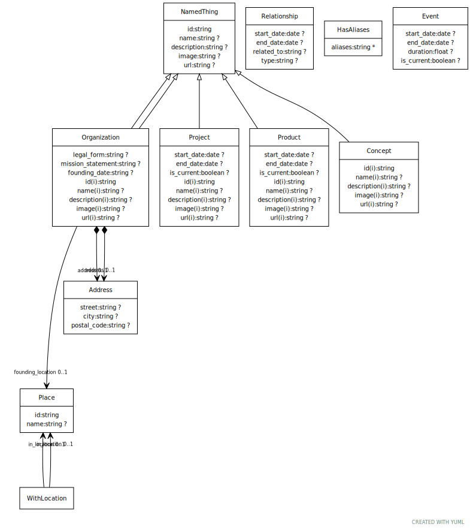

# DAPI Schema

This schema was initialy based on https://github.com/linkml/linkml/tree/main/examples/PersonSchema

An schema to collect/process information about public organisations, their projects, products & service providers based on [schema.org](https://schema.org)
 and [LinkML](https://linkml.io). For other examples, see the [linkml-registry](https://linkml.io/linkml-registry/registry/)

 * [dapi.yaml](dapi.yaml) -- schema source
 * [dapi/](dapi) -- derived files, created with `gen-project`
     * json-schema
     * owl
     * graphql
     * sql
     * ...
 * [data/](data) -- example data files
 * [build/](build) -- derived data files

## Schema diagram

generated via `gen-yuml dapi.yaml -f svg -d .`:

 

https://github.com/linkml/linkml/tree/main/examples/PersonSchema